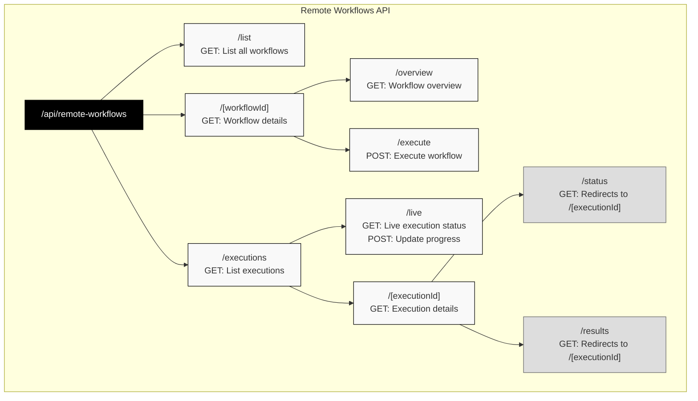

# Remote Workflows API Documentation

## API Structure



## Overview

The Remote Workflows API provides endpoints for managing and executing automated workflows. All endpoints are prefixed with `/api/remote-workflows`.

## API Endpoints

Each endpoint below includes interactive JavaScript and Python code examples. Click on the tabs to view code for your preferred language.

> **Note**: The JavaScript examples use the native `fetch` API, while Python examples use the `requests` library. Make sure to install it with `pip install requests` if you haven't already.

### 1. List Workflows
```
GET /api/remote-workflows/list
```

Lists all available workflows with basic information and performance metrics.

**Query Parameters:**
- `category` (optional): Filter by workflow category
- `status` (optional): Filter by status (default: "active")
- `limit` (optional): Number of results per page (default: 50)
- `offset` (optional): Pagination offset (default: 0)

**Code Examples:**

<details>
<summary>JavaScript</summary>

```javascript
// List all workflows
const response = await fetch('/api/remote-workflows/list', {
  method: 'GET',
  headers: {
    'Content-Type': 'application/json'
  }
});
const data = await response.json();
console.log(data);

// List workflows with filters
const params = new URLSearchParams({
  category: 'insurance',
  status: 'active',
  limit: '10',
  offset: '0'
});

const filteredResponse = await fetch(`/api/remote-workflows/list?${params}`, {
  method: 'GET',
  headers: {
    'Content-Type': 'application/json'
  }
});
const filteredData = await filteredResponse.json();
console.log(filteredData);
```
</details>

<details>
<summary>Python</summary>

```python
import requests

# List all workflows
response = requests.get('/api/remote-workflows/list')
data = response.json()
print(data)

# List workflows with filters
params = {
    'category': 'insurance',
    'status': 'active',
    'limit': 10,
    'offset': 0
}

filtered_response = requests.get('/api/remote-workflows/list', params=params)
filtered_data = filtered_response.json()
print(filtered_data)
```
</details>

**Response:**
```json
{
  "success": true,
  "workflows": [
    {
      "id": 1,
      "name": "Best Plan Pro Insurance Quote",
      "description": "Automated life insurance quote generation",
      "version": "1.0.0",
      "status": "active",
      "category": "insurance",
      "tags": ["insurance", "quotes", "automation"],
      "difficulty_level": "medium",
      "estimated_duration_seconds": 90,
      "performance_metrics": {
        "successful_runs": 4,
        "failed_runs": 27,
        "total_executions": 31,
        "success_rate": 13
      },
      "is_executable": true,
      "deployment_status": "deployed",
      "endpoints": {
        "details": "/api/remote-workflows/1",
        "execute": "/api/remote-workflows/1/execute"
      }
    }
  ],
  "pagination": {
    "total": 1,
    "limit": 50,
    "offset": 0,
    "has_more": false
  }
}
```

---

### 2. Get Workflow Details
```
GET /api/remote-workflows/[workflowId]
```

Retrieves comprehensive details about a specific workflow including automation sequence, validation checks, and recent executions.

**Code Examples:**

<details>
<summary>JavaScript</summary>

```javascript
const workflowId = 1;

const response = await fetch(`/api/remote-workflows/${workflowId}`, {
  method: 'GET',
  headers: {
    'Content-Type': 'application/json'
  }
});

const data = await response.json();

if (data.success) {
  console.log('Workflow Name:', data.workflow.name);
  console.log('Description:', data.workflow.description);
  console.log('Status:', data.workflow.status);
  console.log('Success Rate:', data.workflow.performance_metrics.success_rate + '%');
}
```
</details>

<details>
<summary>Python</summary>

```python
import requests

workflow_id = 1

response = requests.get(f'/api/remote-workflows/{workflow_id}')
data = response.json()

if data['success']:
    print('Workflow Name:', data['workflow']['name'])
    print('Description:', data['workflow']['description'])
    print('Status:', data['workflow']['status'])
    print('Success Rate:', str(data['workflow']['performance_metrics']['success_rate']) + '%')
```
</details>

**Response:**
```json
{
  "success": true,
  "workflow": {
    "id": 1,
    "name": "Best Plan Pro Insurance Quote",
    "description": "Automated life insurance quote generation",
    "version": "1.0.0",
    "status": "active",
    "trigger_info": {
      "endpoint": "/api/remote-workflows/1/execute",
      "method": "POST",
      "required_headers": ["Content-Type: application/json"],
      "modal_function": "execute_workflow",
      "deployment_status": "deployed",
      "is_executable": true
    },
    "automation_sequence": [
      {
        "action": "navigate",
        "url": "https://bestplanpro.com",
        "description": "Navigate to Best Plan Pro website"
      }
    ],
    "validation_checks": [
      {
        "name": "age_validation",
        "description": "Verify age is within acceptable range (18-75)",
        "type": "input_validation"
      }
    ],
    "error_handling": [
      {
        "error_type": "element_not_found",
        "action": "retry",
        "retry_count": 3
      }
    ],
    "input_parameters": {
      "state": {
        "type": "string",
        "required": true,
        "description": "State name"
      }
    },
    "performance_metrics": {
      "successful_runs": 4,
      "failed_runs": 27,
      "total_executions": 31,
      "success_rate": 13
    },
    "recent_executions": [],
    "usage_examples": {
      "curl_example": "curl -X POST https://example.com/api/remote-workflows/1/execute -H 'Content-Type: application/json' -d '{\"customer_info\":{\"state\":\"California\"}}'",
      "javascript_example": "await fetch('/api/remote-workflows/1/execute', { method: 'POST', headers: { 'Content-Type': 'application/json' }, body: JSON.stringify({ customer_info: { state: 'California' } }) })"
    }
  }
}
```

---

### 3. Get Workflow Overview
```
GET /api/remote-workflows/[workflowId]/overview
```

Provides a high-level overview of a workflow including step breakdown and reliability metrics.

**Code Examples:**

<details>
<summary>JavaScript</summary>

```javascript
const workflowId = 1;

const response = await fetch(`/api/remote-workflows/${workflowId}/overview`, {
  method: 'GET',
  headers: {
    'Content-Type': 'application/json'
  }
});

const overview = await response.json();

console.log(`Workflow: ${overview.name}`);
console.log(`Total Steps: ${overview.total_steps}`);
console.log(`Estimated Duration: ${overview.estimated_duration_seconds} seconds`);
console.log(`Reliability Score: ${overview.statistics.reliability_score}`);

// Display step breakdown
overview.step_overview.forEach(step => {
  console.log(`Step ${step.step_number}: ${step.description}`);
});
```
</details>

<details>
<summary>Python</summary>

```python
import requests

workflow_id = 1

response = requests.get(f'/api/remote-workflows/{workflow_id}/overview')
overview = response.json()

print(f"Workflow: {overview['name']}")
print(f"Total Steps: {overview['total_steps']}")
print(f"Estimated Duration: {overview['estimated_duration_seconds']} seconds")
print(f"Reliability Score: {overview['statistics']['reliability_score']}")

# Display step breakdown
for step in overview['step_overview']:
    print(f"Step {step['step_number']}: {step['description']}")
```
</details>

**Response:**
```json
{
  "id": 1,
  "name": "Best Plan Pro Insurance Quote",
  "description": "Automated life insurance quote generation",
  "version": "1.0.0",
  "category": "insurance",
  "tags": ["insurance", "quotes"],
  "difficulty_level": "medium",
  "estimated_duration_seconds": 90,
  "total_steps": 15,
  "step_overview": [
    {
      "step_number": 1,
      "action": "navigate",
      "description": "Navigate to Best Plan Pro website",
      "estimated_duration": 5
    }
  ],
  "required_applications": ["browser"],
  "statistics": {
    "total_executions": 31,
    "successful_runs": 4,
    "failed_runs": 27,
    "success_rate_percent": 13,
    "reliability_score": "poor",
    "last_successful_execution": "2025-01-01T20:08:45.968Z",
    "last_failed_execution": "2025-01-01T20:09:33.238Z"
  }
}
```

---

### 4. Execute Workflow
```
POST /api/remote-workflows/[workflowId]/execute
```

Triggers execution of a workflow with provided parameters.

**Code Examples:**

<details>
<summary>JavaScript</summary>

```javascript
const workflowId = 1;

const requestBody = {
  customer_info: {
    state: "California",
    height: "5'10\"",
    weight: "180",
    zip_code: "90210",
    date_of_birth: "01/15/1985"
  },
  insurance_preferences: {
    gender: "Male",
    nicotine: "Never",
    face_value: "$100,000"
  }
};

const response = await fetch(`/api/remote-workflows/${workflowId}/execute`, {
  method: 'POST',
  headers: {
    'Content-Type': 'application/json'
  },
  body: JSON.stringify(requestBody)
});

const result = await response.json();

if (result.success) {
  console.log(`Execution started! ID: ${result.execution_id}`);
  console.log(`Status: ${result.status}`);
  console.log(`Check status at: ${result.endpoints.status}`);
  console.log(`Get results at: ${result.endpoints.results}`);
  
  // Poll for status
  const checkStatus = async () => {
    const statusResponse = await fetch(result.endpoints.status);
    const statusData = await statusResponse.json();
    console.log('Current Status:', statusData.execution.status);
    
    if (statusData.execution.status === 'running') {
      setTimeout(checkStatus, 5000); // Check again in 5 seconds
    }
  };
  
  setTimeout(checkStatus, 5000); // Start checking after 5 seconds
}
```
</details>

<details>
<summary>Python</summary>

```python
import requests
import time
import json

workflow_id = 1

request_body = {
    "customer_info": {
        "state": "California",
        "height": "5'10\"",
        "weight": "180",
        "zip_code": "90210",
        "date_of_birth": "01/15/1985"
    },
    "insurance_preferences": {
        "gender": "Male",
        "nicotine": "Never",
        "face_value": "$100,000"
    }
}

response = requests.post(
    f'/api/remote-workflows/{workflow_id}/execute',
    headers={'Content-Type': 'application/json'},
    data=json.dumps(request_body)
)

result = response.json()

if result['success']:
    print(f"Execution started! ID: {result['execution_id']}")
    print(f"Status: {result['status']}")
    print(f"Check status at: {result['endpoints']['status']}")
    print(f"Get results at: {result['endpoints']['results']}")
    
    # Poll for status
    while True:
        time.sleep(5)  # Wait 5 seconds between checks
        status_response = requests.get(result['endpoints']['status'])
        status_data = status_response.json()
        print('Current Status:', status_data['execution']['status'])
        
        if status_data['execution']['status'] != 'running':
            break
```
</details>

**Request Body:**
```json
{
  "customer_info": {
    "state": "California",
    "height": "5'10\"",
    "weight": "180",
    "zip_code": "90210",
    "date_of_birth": "01/15/1985"
  },
  "insurance_preferences": {
    "gender": "Male",
    "nicotine": "Never",
    "face_value": "$100,000"
  }
}
```

**Response:**
```json
{
  "success": true,
  "execution_id": 44,
  "status": "queued",
  "message": "Workflow execution started successfully",
  "modal_call_id": "modal_1751407955657_j9p0qn5ks",
  "details": {
    "workflow_id": 1,
    "workflow_name": "Best Plan Pro Insurance Quote",
    "estimated_duration_seconds": 90
  },
  "endpoints": {
    "status": "/api/remote-workflows/executions/44",
    "results": "/api/remote-workflows/executions/44"
  }
}
```

---

### 5. List Executions
```
GET /api/remote-workflows/executions
```

Lists workflow executions with filtering and pagination support.

**Query Parameters:**
- `workflow_id` (optional): Filter by workflow ID
- `status` (optional): Filter by execution status
- `limit` (optional): Results per page (default: 20)
- `offset` (optional): Pagination offset (default: 0)
- `include_results` (optional): Include full results (default: false)

**Code Examples:**

<details>
<summary>JavaScript</summary>

```javascript
// Get all executions
const response = await fetch('/api/remote-workflows/executions', {
  method: 'GET',
  headers: {
    'Content-Type': 'application/json'
  }
});
const data = await response.json();
console.log(`Total executions: ${data.summary.total_executions}`);

// Get executions with filters
const params = new URLSearchParams({
  workflow_id: '1',
  status: 'failed',
  limit: '10',
  include_results: 'true'
});

const filteredResponse = await fetch(`/api/remote-workflows/executions?${params}`, {
  method: 'GET',
  headers: {
    'Content-Type': 'application/json'
  }
});

const filteredData = await filteredResponse.json();
filteredData.executions.forEach(exec => {
  console.log(`Execution ${exec.execution_id}: ${exec.status}`);
  if (exec.has_error) {
    console.log(`  Error: ${exec.error_message || 'Unknown error'}`);
  }
});

// Paginate through results
const getAllExecutions = async () => {
  let allExecutions = [];
  let offset = 0;
  const limit = 50;
  
  while (true) {
    const pageParams = new URLSearchParams({
      limit: limit.toString(),
      offset: offset.toString()
    });
    
    const pageResponse = await fetch(`/api/remote-workflows/executions?${pageParams}`);
    const pageData = await pageResponse.json();
    
    allExecutions = allExecutions.concat(pageData.executions);
    
    if (!pageData.pagination.has_more) break;
    offset += limit;
  }
  
  return allExecutions;
};
```
</details>

<details>
<summary>Python</summary>

```python
import requests

# Get all executions
response = requests.get('/api/remote-workflows/executions')
data = response.json()
print(f"Total executions: {data['summary']['total_executions']}")

# Get executions with filters
params = {
    'workflow_id': 1,
    'status': 'failed',
    'limit': 10,
    'include_results': True
}

filtered_response = requests.get('/api/remote-workflows/executions', params=params)
filtered_data = filtered_response.json()

for exec in filtered_data['executions']:
    print(f"Execution {exec['execution_id']}: {exec['status']}")
    if exec['has_error']:
        print(f"  Error: {exec.get('error_message', 'Unknown error')}")

# Paginate through all results
def get_all_executions():
    all_executions = []
    offset = 0
    limit = 50
    
    while True:
        params = {
            'limit': limit,
            'offset': offset
        }
        
        page_response = requests.get('/api/remote-workflows/executions', params=params)
        page_data = page_response.json()
        
        all_executions.extend(page_data['executions'])
        
        if not page_data['pagination']['has_more']:
            break
        
        offset += limit
    
    return all_executions

# Get all executions
all_execs = get_all_executions()
print(f"Retrieved {len(all_execs)} total executions")
```
</details>

**Response:**
```json
{
  "success": true,
  "executions": [
    {
      "execution_id": 44,
      "workflow_id": 1,
      "workflow_name": "Best Plan Pro Insurance Quote",
      "workflow_category": "insurance",
      "status": "running",
      "progress_percentage": 50,
      "current_step": 8,
      "total_steps": 15,
      "started_at": "2025-01-01T20:12:35.657Z",
      "runtime_seconds": 45,
      "is_running": true,
      "is_successful": false,
      "has_error": false,
      "modal_call_id": "modal_1751407955657_j9p0qn5ks"
    }
  ],
  "summary": {
    "total_executions": 44,
    "by_status": {
      "running": 2,
      "failed": 40,
      "completed": 2
    }
  },
  "pagination": {
    "total": 44,
    "limit": 20,
    "offset": 0,
    "has_more": true
  }
}
```

---

### 6. Get Execution Details
```
GET /api/remote-workflows/executions/[executionId]
```

Retrieves complete details about a specific execution including logs, results, and formatted output.

**Code Examples:**

<details>
<summary>JavaScript</summary>

```javascript
const executionId = 44;

const response = await fetch(`/api/remote-workflows/executions/${executionId}`, {
  method: 'GET',
  headers: {
    'Content-Type': 'application/json'
  }
});

const data = await response.json();

if (data.success) {
  const exec = data.execution;
  
  console.log(`Execution ID: ${exec.execution_id}`);
  console.log(`Workflow: ${exec.workflow_name}`);
  console.log(`Status: ${exec.status}`);
  console.log(`Duration: ${exec.execution_duration_seconds} seconds`);
  
  if (exec.is_successful) {
    console.log('\n✅ Execution completed successfully!');
    console.log('\nResults:', exec.results);
  } else if (exec.has_failed) {
    console.log('\n❌ Execution failed!');
    console.log('Error:', exec.error_message);
  }
  
  // Display formatted output
  console.log('\n--- Formatted Output ---');
  console.log(exec.formatted_output);
  
  // Access raw logs if needed
  if (exec.raw_data && exec.raw_data.raw_logs) {
    console.log('\n--- Raw Logs ---');
    console.log(exec.raw_data.raw_logs);
  }
}

// Helper function to wait for execution completion
const waitForCompletion = async (executionId, maxWaitSeconds = 300) => {
  const startTime = Date.now();
  
  while ((Date.now() - startTime) / 1000 < maxWaitSeconds) {
    const response = await fetch(`/api/remote-workflows/executions/${executionId}`);
    const data = await response.json();
    
    if (data.execution.status !== 'running' && data.execution.status !== 'queued') {
      return data.execution;
    }
    
    await new Promise(resolve => setTimeout(resolve, 5000)); // Wait 5 seconds
  }
  
  throw new Error('Execution timeout');
};
```
</details>

<details>
<summary>Python</summary>

```python
import requests
import time

execution_id = 44

response = requests.get(f'/api/remote-workflows/executions/{execution_id}')
data = response.json()

if data['success']:
    exec = data['execution']
    
    print(f"Execution ID: {exec['execution_id']}")
    print(f"Workflow: {exec['workflow_name']}")
    print(f"Status: {exec['status']}")
    print(f"Duration: {exec['execution_duration_seconds']} seconds")
    
    if exec['is_successful']:
        print('\n✅ Execution completed successfully!')
        print('\nResults:', exec['results'])
    elif exec['has_failed']:
        print('\n❌ Execution failed!')
        print('Error:', exec['error_message'])
    
    # Display formatted output
    print('\n--- Formatted Output ---')
    print(exec['formatted_output'])
    
    # Access raw logs if needed
    if 'raw_data' in exec and 'raw_logs' in exec['raw_data']:
        print('\n--- Raw Logs ---')
        print(exec['raw_data']['raw_logs'])

# Helper function to wait for execution completion
def wait_for_completion(execution_id, max_wait_seconds=300):
    start_time = time.time()
    
    while time.time() - start_time < max_wait_seconds:
        response = requests.get(f'/api/remote-workflows/executions/{execution_id}')
        data = response.json()
        
        status = data['execution']['status']
        if status not in ['running', 'queued']:
            return data['execution']
        
        time.sleep(5)  # Wait 5 seconds before next check
    
    raise TimeoutError('Execution timeout')

# Example usage
try:
    result = wait_for_completion(execution_id)
    print(f"Final status: {result['status']}")
except TimeoutError:
    print("Execution took too long")
```
</details>

**Response:**
```json
{
  "success": true,
  "execution": {
    "execution_id": 44,
    "workflow_id": 1,
    "workflow_name": "Best Plan Pro Insurance Quote",
    "status": "failed",
    "is_successful": false,
    "has_failed": true,
    "started_at": "2025-01-01T20:12:35.657Z",
    "completed_at": "2025-01-01T20:12:37.238Z",
    "execution_duration_seconds": 2,
    "error_message": "MCP Execution Failed",
    "execution_params": {
      "customer_info": {...}
    },
    "results": {
      "error_details": "MCP endpoint test failed",
      "execution_summary": {
        "workflow_completed": false
      }
    },
    "formatted_output": "❌ Workflow execution failed!\n\n📊 Error Summary...",
    "raw_data": {
      "raw_logs": "Starting workflow execution...",
      "raw_mcp_response": {...},
      "execution_logs": []
    },
    "summary": {
      "execution_successful": false,
      "workflow_completed": false,
      "steps_completed": 0,
      "error_stage": "mcp_connection"
    }
  }
}
```

---

### 7. Live Execution Status
```
GET /api/remote-workflows/executions/live
```

Retrieves real-time status of running executions.

**Query Parameters:**
- `status` (optional): Filter by status ("active" for running/queued)
- `workflow_id` (optional): Filter by workflow ID
- `limit` (optional): Max results (default: 50)

**Code Examples:**

<details>
<summary>JavaScript</summary>

```javascript
// Get all live executions
const response = await fetch('/api/remote-workflows/executions/live', {
  method: 'GET',
  headers: {
    'Content-Type': 'application/json'
  }
});

const data = await response.json();

if (data.success) {
  console.log(`Active executions: ${data.data.summary.total_active}`);
  console.log(`Running: ${data.data.summary.total_running}`);
  console.log(`Queued: ${data.data.summary.total_queued}`);
  
  // Display progress for each execution
  data.data.executions.forEach(exec => {
    console.log(`\nExecution ${exec.id} - ${exec.workflow_name}`);
    console.log(`Progress: ${exec.progress_percentage}%`);
    console.log(`Current Step: ${exec.current_step_description}`);
    console.log(`Step ${exec.current_step_index}/${exec.total_steps}`);
    console.log(`ETA: ${exec.estimated_seconds_remaining} seconds`);
  });
}

// Monitor a specific workflow's executions
const monitorWorkflow = async (workflowId) => {
  const params = new URLSearchParams({
    workflow_id: workflowId.toString(),
    status: 'active'
  });
  
  const response = await fetch(`/api/remote-workflows/executions/live?${params}`);
  const data = await response.json();
  
  return data.data.executions;
};

// Create a live dashboard
const createLiveDashboard = async (refreshInterval = 2000) => {
  const updateDashboard = async () => {
    console.clear();
    console.log('=== Live Execution Dashboard ===\n');
    
    const response = await fetch('/api/remote-workflows/executions/live?status=active');
    const data = await response.json();
    
    if (data.data.executions.length === 0) {
      console.log('No active executions');
    } else {
      data.data.executions.forEach(exec => {
        const progressBar = '█'.repeat(exec.progress_percentage / 5) + 
                          '░'.repeat(20 - exec.progress_percentage / 5);
        console.log(`[${exec.id}] ${exec.workflow_name}`);
        console.log(`[${progressBar}] ${exec.progress_percentage}%`);
        console.log(`Step: ${exec.current_step_description}\n`);
      });
    }
    
    console.log(`\nUpdated: ${new Date().toLocaleTimeString()}`);
  };
  
  // Initial update
  await updateDashboard();
  
  // Set up refresh interval
  return setInterval(updateDashboard, refreshInterval);
};

// Usage: const dashboard = await createLiveDashboard();
// To stop: clearInterval(dashboard);
```
</details>

<details>
<summary>Python</summary>

```python
import requests
import time
from datetime import datetime

# Get all live executions
response = requests.get('/api/remote-workflows/executions/live')
data = response.json()

if data['success']:
    summary = data['data']['summary']
    print(f"Active executions: {summary['total_active']}")
    print(f"Running: {summary['total_running']}")
    print(f"Queued: {summary['total_queued']}")
    
    # Display progress for each execution
    for exec in data['data']['executions']:
        print(f"\nExecution {exec['id']} - {exec['workflow_name']}")
        print(f"Progress: {exec['progress_percentage']}%")
        print(f"Current Step: {exec['current_step_description']}")
        print(f"Step {exec['current_step_index']}/{exec['total_steps']}")
        print(f"ETA: {exec['estimated_seconds_remaining']} seconds")

# Monitor a specific workflow's executions
def monitor_workflow(workflow_id):
    params = {
        'workflow_id': workflow_id,
        'status': 'active'
    }
    
    response = requests.get('/api/remote-workflows/executions/live', params=params)
    data = response.json()
    
    return data['data']['executions']

# Create a live dashboard
def create_live_dashboard(refresh_interval=2):
    import os
    
    try:
        while True:
            # Clear screen (works on most terminals)
            os.system('clear' if os.name == 'posix' else 'cls')
            
            print('=== Live Execution Dashboard ===\n')
            
            response = requests.get('/api/remote-workflows/executions/live', 
                                  params={'status': 'active'})
            data = response.json()
            
            executions = data['data']['executions']
            
            if not executions:
                print('No active executions')
            else:
                for exec in executions:
                    # Create progress bar
                    progress = exec['progress_percentage']
                    bar_length = 20
                    filled = int(bar_length * progress / 100)
                    bar = '█' * filled + '░' * (bar_length - filled)
                    
                    print(f"[{exec['id']}] {exec['workflow_name']}")
                    print(f"[{bar}] {progress}%")
                    print(f"Step: {exec['current_step_description']}\n")
            
            print(f"\nUpdated: {datetime.now().strftime('%H:%M:%S')}")
            print("Press Ctrl+C to exit")
            
            time.sleep(refresh_interval)
            
    except KeyboardInterrupt:
        print("\nDashboard stopped")

# Usage: create_live_dashboard()
```
</details>

**Response:**
```json
{
  "success": true,
  "data": {
    "executions": [
      {
        "id": 44,
        "workflow_id": 1,
        "workflow_name": "Best Plan Pro Insurance Quote",
        "status": "running",
        "progress_percentage": 75,
        "current_step_index": 12,
        "total_steps": 15,
        "current_step_description": "Extracting quote results",
        "estimated_seconds_remaining": 22,
        "steps_per_minute": 8.5
      }
    ],
    "summary": {
      "total_active": 2,
      "total_running": 2,
      "total_queued": 0,
      "average_progress": 75
    }
  }
}
```

---

### 8. Update Execution Progress
```
POST /api/remote-workflows/executions/live
```

Updates the progress of a running execution (used by execution workers).

**Code Examples:**

<details>
<summary>JavaScript</summary>

```javascript
// Update execution progress
const updateProgress = async (executionId, progress, stepIndex, stepDescription, totalSteps) => {
  const updateData = {
    execution_id: executionId,
    progress_percentage: progress,
    current_step_index: stepIndex,
    current_step_description: stepDescription,
    total_steps: totalSteps
  };

  const response = await fetch('/api/remote-workflows/executions/live', {
    method: 'POST',
    headers: {
      'Content-Type': 'application/json'
    },
    body: JSON.stringify(updateData)
  });

  const result = await response.json();
  
  if (result.success) {
    console.log(`Progress updated for execution ${executionId}: ${progress}%`);
  } else {
    console.error('Failed to update progress:', result.message);
  }
  
  return result;
};

// Example: Simulating a workflow execution with progress updates
const simulateWorkflowExecution = async (executionId) => {
  const steps = [
    { index: 1, description: 'Initializing browser', progress: 10 },
    { index: 2, description: 'Navigating to website', progress: 20 },
    { index: 3, description: 'Filling form data', progress: 40 },
    { index: 4, description: 'Submitting information', progress: 60 },
    { index: 5, description: 'Waiting for results', progress: 80 },
    { index: 6, description: 'Extracting data', progress: 90 },
    { index: 7, description: 'Finalizing results', progress: 100 }
  ];
  
  const totalSteps = steps.length;
  
  for (const step of steps) {
    await updateProgress(
      executionId,
      step.progress,
      step.index,
      step.description,
      totalSteps
    );
    
    // Simulate work being done
    await new Promise(resolve => setTimeout(resolve, 2000));
  }
  
  console.log('Workflow execution simulation completed');
};

// Worker pattern for processing executions
class ExecutionWorker {
  constructor(workerId) {
    this.workerId = workerId;
  }
  
  async processExecution(executionId, workflowSteps) {
    console.log(`Worker ${this.workerId} processing execution ${executionId}`);
    
    try {
      for (let i = 0; i < workflowSteps.length; i++) {
        const step = workflowSteps[i];
        const progress = Math.round(((i + 1) / workflowSteps.length) * 100);
        
        // Update progress before executing step
        await updateProgress(
          executionId,
          progress,
          i + 1,
          `Executing: ${step.description}`,
          workflowSteps.length
        );
        
        // Execute the actual step
        await this.executeStep(step);
      }
      
      console.log(`Worker ${this.workerId} completed execution ${executionId}`);
    } catch (error) {
      console.error(`Worker ${this.workerId} error:`, error);
      throw error;
    }
  }
  
  async executeStep(step) {
    // Simulate step execution
    await new Promise(resolve => setTimeout(resolve, 1000));
  }
}
```
</details>

<details>
<summary>Python</summary>

```python
import requests
import json
import time
import asyncio
from typing import Dict, List

# Update execution progress
def update_progress(execution_id: int, progress: int, step_index: int, 
                   step_description: str, total_steps: int) -> Dict:
    update_data = {
        "execution_id": execution_id,
        "progress_percentage": progress,
        "current_step_index": step_index,
        "current_step_description": step_description,
        "total_steps": total_steps
    }
    
    response = requests.post(
        '/api/remote-workflows/executions/live',
        headers={'Content-Type': 'application/json'},
        data=json.dumps(update_data)
    )
    
    result = response.json()
    
    if result['success']:
        print(f"Progress updated for execution {execution_id}: {progress}%")
    else:
        print(f"Failed to update progress: {result.get('message', 'Unknown error')}")
    
    return result

# Example: Simulating a workflow execution with progress updates
def simulate_workflow_execution(execution_id: int):
    steps = [
        {"index": 1, "description": "Initializing browser", "progress": 10},
        {"index": 2, "description": "Navigating to website", "progress": 20},
        {"index": 3, "description": "Filling form data", "progress": 40},
        {"index": 4, "description": "Submitting information", "progress": 60},
        {"index": 5, "description": "Waiting for results", "progress": 80},
        {"index": 6, "description": "Extracting data", "progress": 90},
        {"index": 7, "description": "Finalizing results", "progress": 100}
    ]
    
    total_steps = len(steps)
    
    for step in steps:
        update_progress(
            execution_id,
            step['progress'],
            step['index'],
            step['description'],
            total_steps
        )
        
        # Simulate work being done
        time.sleep(2)
    
    print('Workflow execution simulation completed')

# Worker class for processing executions
class ExecutionWorker:
    def __init__(self, worker_id: str):
        self.worker_id = worker_id
    
    def process_execution(self, execution_id: int, workflow_steps: List[Dict]):
        print(f"Worker {self.worker_id} processing execution {execution_id}")
        
        try:
            for i, step in enumerate(workflow_steps):
                progress = round(((i + 1) / len(workflow_steps)) * 100)
                
                # Update progress before executing step
                update_progress(
                    execution_id,
                    progress,
                    i + 1,
                    f"Executing: {step['description']}",
                    len(workflow_steps)
                )
                
                # Execute the actual step
                self.execute_step(step)
            
            print(f"Worker {self.worker_id} completed execution {execution_id}")
            
        except Exception as error:
            print(f"Worker {self.worker_id} error: {error}")
            raise
    
    def execute_step(self, step: Dict):
        # Simulate step execution
        time.sleep(1)

# Async version for concurrent execution updates
async def async_update_progress(session, execution_id: int, progress: int, 
                               step_index: int, step_description: str, 
                               total_steps: int):
    import aiohttp
    
    update_data = {
        "execution_id": execution_id,
        "progress_percentage": progress,
        "current_step_index": step_index,
        "current_step_description": step_description,
        "total_steps": total_steps
    }
    
    async with session.post('/api/remote-workflows/executions/live', 
                           json=update_data) as response:
        result = await response.json()
        print(f"Updated execution {execution_id}: {progress}%")
        return result

# Example usage
if __name__ == "__main__":
    # Simulate an execution
    simulate_workflow_execution(44)
    
    # Or use a worker
    worker = ExecutionWorker("worker-1")
    workflow_steps = [
        {"description": "Step 1", "action": "navigate"},
        {"description": "Step 2", "action": "fill_form"},
        {"description": "Step 3", "action": "submit"}
    ]
    worker.process_execution(45, workflow_steps)
```
</details>

**Request Body:**
```json
{
  "execution_id": 44,
  "progress_percentage": 80,
  "current_step_index": 13,
  "current_step_description": "Finalizing results",
  "total_steps": 15
}
```

**Response:**
```json
{
  "success": true,
  "message": "Execution progress updated successfully",
  "data": {
    "execution_id": 44,
    "progress_percentage": 80,
    "updated_at": "2025-01-01T20:13:15.000Z"
  }
}
```

---

## Status Codes

- `200` - Success
- `400` - Bad Request (invalid parameters)
- `404` - Resource not found
- `500` - Internal server error

## Rate Limiting

API endpoints are rate-limited to prevent abuse:
- List endpoints: 100 requests per minute
- Execution endpoints: 10 requests per minute per workflow
- Status polling: 120 requests per minute 