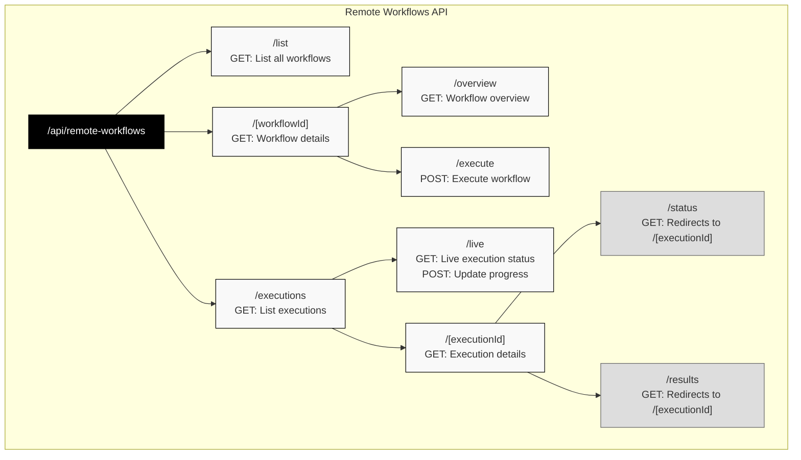

# Remote Workflows API Documentation

## API Structure



## Overview

The Remote Workflows API provides endpoints for managing and executing automated workflows. All endpoints are prefixed with `/api/remote-workflows`.

## API Endpoints

### 1. List Workflows
```
GET /api/remote-workflows/list
```

Lists all available workflows with basic information and performance metrics.

**Query Parameters:**
- `category` (optional): Filter by workflow category
- `status` (optional): Filter by status (default: "active")
- `limit` (optional): Number of results per page (default: 50)
- `offset` (optional): Pagination offset (default: 0)

**Response:**
```json
{
  "success": true,
  "workflows": [
    {
      "id": 1,
      "name": "Best Plan Pro Insurance Quote",
      "description": "Automated life insurance quote generation",
      "version": "1.0.0",
      "status": "active",
      "category": "insurance",
      "tags": ["insurance", "quotes", "automation"],
      "difficulty_level": "medium",
      "estimated_duration_seconds": 90,
      "performance_metrics": {
        "successful_runs": 4,
        "failed_runs": 27,
        "total_executions": 31,
        "success_rate": 13
      },
      "is_executable": true,
      "deployment_status": "deployed",
      "endpoints": {
        "details": "/api/remote-workflows/1",
        "execute": "/api/remote-workflows/1/execute"
      }
    }
  ],
  "pagination": {
    "total": 1,
    "limit": 50,
    "offset": 0,
    "has_more": false
  }
}
```

---

### 2. Get Workflow Details
```
GET /api/remote-workflows/[workflowId]
```

Retrieves comprehensive details about a specific workflow including automation sequence, validation checks, and recent executions.

**Response:**
```json
{
  "success": true,
  "workflow": {
    "id": 1,
    "name": "Best Plan Pro Insurance Quote",
    "description": "Automated life insurance quote generation",
    "version": "1.0.0",
    "status": "active",
    "trigger_info": {
      "endpoint": "/api/remote-workflows/1/execute",
      "method": "POST",
      "required_headers": ["Content-Type: application/json"],
      "modal_function": "execute_workflow",
      "deployment_status": "deployed",
      "is_executable": true
    },
    "automation_sequence": [
      {
        "action": "navigate",
        "url": "https://bestplanpro.com",
        "description": "Navigate to Best Plan Pro website"
      }
    ],
    "validation_checks": [
      {
        "name": "age_validation",
        "description": "Verify age is within acceptable range (18-75)",
        "type": "input_validation"
      }
    ],
    "error_handling": [
      {
        "error_type": "element_not_found",
        "action": "retry",
        "retry_count": 3
      }
    ],
    "input_parameters": {
      "state": {
        "type": "string",
        "required": true,
        "description": "State name"
      }
    },
    "performance_metrics": {
      "successful_runs": 4,
      "failed_runs": 27,
      "total_executions": 31,
      "success_rate": 13
    },
    "recent_executions": [],
    "usage_examples": {
      "curl_example": "curl -X POST...",
      "javascript_example": "fetch('/api/remote-workflows/1/execute'..."
    }
  }
}
```

---

### 3. Get Workflow Overview
```
GET /api/remote-workflows/[workflowId]/overview
```

Provides a high-level overview of a workflow including step breakdown and reliability metrics.

**Response:**
```json
{
  "id": 1,
  "name": "Best Plan Pro Insurance Quote",
  "description": "Automated life insurance quote generation",
  "version": "1.0.0",
  "category": "insurance",
  "tags": ["insurance", "quotes"],
  "difficulty_level": "medium",
  "estimated_duration_seconds": 90,
  "total_steps": 15,
  "step_overview": [
    {
      "step_number": 1,
      "action": "navigate",
      "description": "Navigate to Best Plan Pro website",
      "estimated_duration": 5
    }
  ],
  "required_applications": ["browser"],
  "statistics": {
    "total_executions": 31,
    "successful_runs": 4,
    "failed_runs": 27,
    "success_rate_percent": 13,
    "reliability_score": "poor",
    "last_successful_execution": "2025-01-01T20:08:45.968Z",
    "last_failed_execution": "2025-01-01T20:09:33.238Z"
  }
}
```

---

### 4. Execute Workflow
```
POST /api/remote-workflows/[workflowId]/execute
```

Triggers execution of a workflow with provided parameters.

**Request Body:**
```json
{
  "customer_info": {
    "state": "California",
    "height": "5'10\"",
    "weight": "180",
    "zip_code": "90210",
    "date_of_birth": "01/15/1985"
  },
  "insurance_preferences": {
    "gender": "Male",
    "nicotine": "Never",
    "face_value": "$100,000"
  }
}
```

**Response:**
```json
{
  "success": true,
  "execution_id": 44,
  "status": "queued",
  "message": "Workflow execution started successfully",
  "modal_call_id": "modal_1751407955657_j9p0qn5ks",
  "details": {
    "workflow_id": 1,
    "workflow_name": "Best Plan Pro Insurance Quote",
    "estimated_duration_seconds": 90
  },
  "endpoints": {
    "status": "/api/remote-workflows/executions/44",
    "results": "/api/remote-workflows/executions/44"
  }
}
```

---

### 5. List Executions
```
GET /api/remote-workflows/executions
```

Lists workflow executions with filtering and pagination support.

**Query Parameters:**
- `workflow_id` (optional): Filter by workflow ID
- `status` (optional): Filter by execution status
- `limit` (optional): Results per page (default: 20)
- `offset` (optional): Pagination offset (default: 0)
- `include_results` (optional): Include full results (default: false)

**Response:**
```json
{
  "success": true,
  "executions": [
    {
      "execution_id": 44,
      "workflow_id": 1,
      "workflow_name": "Best Plan Pro Insurance Quote",
      "workflow_category": "insurance",
      "status": "running",
      "progress_percentage": 50,
      "current_step": 8,
      "total_steps": 15,
      "started_at": "2025-01-01T20:12:35.657Z",
      "runtime_seconds": 45,
      "is_running": true,
      "is_successful": false,
      "has_error": false,
      "modal_call_id": "modal_1751407955657_j9p0qn5ks"
    }
  ],
  "summary": {
    "total_executions": 44,
    "by_status": {
      "running": 2,
      "failed": 40,
      "completed": 2
    }
  },
  "pagination": {
    "total": 44,
    "limit": 20,
    "offset": 0,
    "has_more": true
  }
}
```

---

### 6. Get Execution Details
```
GET /api/remote-workflows/executions/[executionId]
```

Retrieves complete details about a specific execution including logs, results, and formatted output.

**Response:**
```json
{
  "success": true,
  "execution": {
    "execution_id": 44,
    "workflow_id": 1,
    "workflow_name": "Best Plan Pro Insurance Quote",
    "status": "failed",
    "is_successful": false,
    "has_failed": true,
    "started_at": "2025-01-01T20:12:35.657Z",
    "completed_at": "2025-01-01T20:12:37.238Z",
    "execution_duration_seconds": 2,
    "error_message": "MCP Execution Failed",
    "execution_params": {
      "customer_info": {...}
    },
    "results": {
      "error_details": "MCP endpoint test failed",
      "execution_summary": {
        "workflow_completed": false
      }
    },
    "formatted_output": "❌ Workflow execution failed!\n\n📊 Error Summary...",
    "raw_data": {
      "raw_logs": "Starting workflow execution...",
      "raw_mcp_response": {...},
      "execution_logs": []
    },
    "summary": {
      "execution_successful": false,
      "workflow_completed": false,
      "steps_completed": 0,
      "error_stage": "mcp_connection"
    }
  }
}
```

---

### 7. Live Execution Status
```
GET /api/remote-workflows/executions/live
```

Retrieves real-time status of running executions.

**Query Parameters:**
- `status` (optional): Filter by status ("active" for running/queued)
- `workflow_id` (optional): Filter by workflow ID
- `limit` (optional): Max results (default: 50)

**Response:**
```json
{
  "success": true,
  "data": {
    "executions": [
      {
        "id": 44,
        "workflow_id": 1,
        "workflow_name": "Best Plan Pro Insurance Quote",
        "status": "running",
        "progress_percentage": 75,
        "current_step_index": 12,
        "total_steps": 15,
        "current_step_description": "Extracting quote results",
        "estimated_seconds_remaining": 22,
        "steps_per_minute": 8.5
      }
    ],
    "summary": {
      "total_active": 2,
      "total_running": 2,
      "total_queued": 0,
      "average_progress": 75
    }
  }
}
```

---

### 8. Update Execution Progress
```
POST /api/remote-workflows/executions/live
```

Updates the progress of a running execution (used by execution workers).

**Request Body:**
```json
{
  "execution_id": 44,
  "progress_percentage": 80,
  "current_step_index": 13,
  "current_step_description": "Finalizing results",
  "total_steps": 15
}
```

**Response:**
```json
{
  "success": true,
  "message": "Execution progress updated successfully",
  "data": {
    "execution_id": 44,
    "progress_percentage": 80,
    "updated_at": "2025-01-01T20:13:15.000Z"
  }
}
```

---

## Status Codes

- `200` - Success
- `400` - Bad Request (invalid parameters)
- `404` - Resource not found
- `500` - Internal server error

## Rate Limiting

API endpoints are rate-limited to prevent abuse:
- List endpoints: 100 requests per minute
- Execution endpoints: 10 requests per minute per workflow
- Status polling: 120 requests per minute 