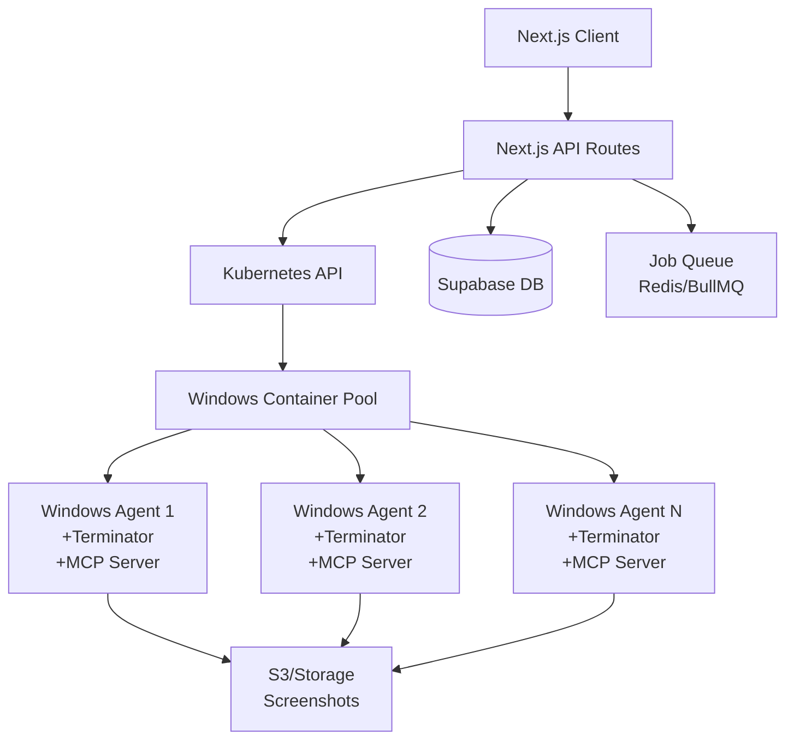

# PR: Design for Kubernetes-based Windows Automation Agent API

## Overview

This pull request proposes a comprehensive design for implementing a Next.js API that leverages Kubernetes to deploy Windows automation agents in containers. The agents will use the [terminator](https://github.com/mediar-ai/terminator) automation framework with MCP (Model Context Protocol) server integration to provide scalable, on-demand browser and desktop automation capabilities.

## Problem Statement

Currently, our workflow execution relies on single MCP endpoints (ngrok tunnels) that can become bottlenecks. We need a scalable solution that can:
- Dynamically provision Windows automation agents based on demand
- Handle concurrent workflow executions without conflicts
- Provide isolated environments for each automation session (one agent per container for exclusive UI control)
- Ensure proper resource cleanup after execution

## Proposed Solution

### Architecture Overview



### Key Components

#### Architecture Note: One Agent Per Container

**Important**: Each Windows container runs exactly one automation agent. This 1:1 relationship is critical because:
- Windows UI automation requires exclusive control of the desktop session
- Multiple agents in the same container would conflict when trying to control mouse/keyboard
- Each container provides an isolated Windows desktop environment
- This ensures predictable behavior and prevents race conditions

The scaling strategy is to spin up more containers (pods) rather than multiple agents within a container.

#### 1. Next.js API Routes

**New routes to implement:**

```typescript
// src/app/api/automation-agents/route.ts
POST   /api/automation-agents           // Create new agent
GET    /api/automation-agents           // List agents
GET    /api/automation-agents/[id]      // Get agent status
DELETE /api/automation-agents/[id]      // Terminate agent

// src/app/api/automation-agents/[id]/execute/route.ts
POST   /api/automation-agents/[id]/execute  // Execute workflow on agent

// src/app/api/automation-agents/pool/route.ts
GET    /api/automation-agents/pool      // Get pool status
POST   /api/automation-agents/pool      // Configure pool settings
```

#### 2. Windows Container Configuration

**Dockerfile for Windows automation agent:**

```dockerfile
# Windows Automation Agent Container
# Each container runs exactly ONE agent instance for exclusive UI control
# escape=`
FROM mcr.microsoft.com/windows/servercore:ltsc2022

# Install Chocolatey for package management
RUN powershell -NoProfile -ExecutionPolicy Bypass -Command `
    "[System.Net.ServicePointManager]::SecurityProtocol = [System.Net.ServicePointManager]::SecurityProtocol -bor 3072; `
    iex ((New-Object System.Net.WebClient).DownloadString('https://community.chocolatey.org/install.ps1'))"

# Install required dependencies
RUN choco install -y nodejs git python3 visualstudio2022buildtools

# Install Windows features for UI automation
RUN powershell -Command `
    "Enable-WindowsOptionalFeature -Online -FeatureName 'NetFx3', 'NetFx4-AdvSrvs' -All -NoRestart"

# Create app directory
WORKDIR C:\app

# Clone and setup terminator
RUN git clone https://github.com/mediar-ai/terminator.git C:\terminator
WORKDIR C:\terminator

# Install terminator dependencies
RUN npm install
RUN npm run build

# Setup MCP server
COPY mcp-server C:\mcp-server
WORKDIR C:\mcp-server
RUN npm install
RUN npm run build

# Copy startup script
COPY start-agent.ps1 C:\app\start-agent.ps1

# Expose MCP server port
EXPOSE 3000

# Set environment variables
ENV MCP_PORT=3000
ENV TERMINATOR_PATH=C:\terminator
ENV ENABLE_SCREEN_CAPTURE=true

ENTRYPOINT ["powershell", "-File", "C:\\app\\start-agent.ps1"]
```

#### 3. Kubernetes Manifests

**Deployment for Windows node pool:**

```yaml
# k8s/windows-agent-deployment.yaml
apiVersion: apps/v1
kind: Deployment
metadata:
  name: windows-automation-agents
  namespace: automation
spec:
  replicas: 3  # Initial pool size (3 containers = 3 agents)
  selector:
    matchLabels:
      app: windows-automation-agent
  template:
    metadata:
      labels:
        app: windows-automation-agent
    spec:
      nodeSelector:
        kubernetes.io/os: windows
      containers:
      - name: automation-agent
        image: mediar/windows-automation-agent:latest
        resources:
          requests:
            memory: "4Gi"
            cpu: "2"
          limits:
            memory: "8Gi"
            cpu: "4"
        env:
        - name: AGENT_ID
          valueFrom:
            fieldRef:
              fieldPath: metadata.name
        - name: MCP_AUTH_TOKEN
          valueFrom:
            secretKeyRef:
              name: automation-secrets
              key: mcp-auth-token
        ports:
        - containerPort: 3000
          name: mcp
        volumeMounts:
        - name: screenshots
          mountPath: C:\screenshots
        livenessProbe:
          httpGet:
            path: /health
            port: 3000
          initialDelaySeconds: 30
          periodSeconds: 10
        readinessProbe:
          httpGet:
            path: /ready
            port: 3000
          initialDelaySeconds: 20
          periodSeconds: 5
      volumes:
      - name: screenshots
        persistentVolumeClaim:
          claimName: screenshots-pvc
```

**Service for agent discovery:**

```yaml
# k8s/windows-agent-service.yaml
apiVersion: v1
kind: Service
metadata:
  name: windows-automation-agents
  namespace: automation
spec:
  selector:
    app: windows-automation-agent
  ports:
  - port: 3000
    targetPort: 3000
    name: mcp
  type: ClusterIP
```

**HorizontalPodAutoscaler for dynamic scaling:**

```yaml
# k8s/windows-agent-hpa.yaml
apiVersion: autoscaling/v2
kind: HorizontalPodAutoscaler
metadata:
  name: windows-automation-agents-hpa
  namespace: automation
spec:
  scaleTargetRef:
    apiVersion: apps/v1
    kind: Deployment
    name: windows-automation-agents
  minReplicas: 2
  maxReplicas: 20
  metrics:
  - type: Resource
    resource:
      name: cpu
      target:
        type: Utilization
        averageUtilization: 50
  - type: Resource
    resource:
      name: memory
      target:
        type: Utilization
        averageUtilization: 70
  - type: Pods
    pods:
      metric:
        name: active_workflows
      target:
        type: AverageValue
        averageValue: "2"  # Scale up if avg > 2 workflows per pod
```

#### 4. API Implementation

**Core service for managing agents:**

```typescript
// src/lib/kubernetes/agent-manager.ts
import { KubeConfig, CoreV1Api, AppsV1Api } from '@kubernetes/client-node';
import { createClient } from '@supabase/supabase-js';
import { v4 as uuidv4 } from 'uuid';

export class WindowsAgentManager {
  private k8sCore: CoreV1Api;
  private k8sApps: AppsV1Api;
  private supabase: ReturnType<typeof createClient>;
  
  constructor() {
    const kc = new KubeConfig();
    kc.loadFromDefault();
    
    this.k8sCore = kc.makeApiClient(CoreV1Api);
    this.k8sApps = kc.makeApiClient(AppsV1Api);
    this.supabase = createClient(
      process.env.NEXT_PUBLIC_SUPABASE_URL!,
      process.env.SUPABASE_SERVICE_KEY!
    );
  }

  async provisionAgent(workflowId: string, userId: string): Promise<AgentInfo> {
    // Check for available containers (each container = one agent)
    const availableAgent = await this.findAvailableAgent();
    
    if (availableAgent) {
      // Mark the entire container/pod as busy (exclusive to this workflow)
      await this.markAgentBusy(availableAgent.id);
      return availableAgent;
    }
    
    // No available containers, check if we can scale up
    const canScale = await this.canScaleUp();
    
    if (!canScale) {
      throw new Error('No available agents and scaling limit reached');
    }
    
    // Trigger scale up to create a new container with its own agent
    await this.triggerScaleUp();
    return await this.waitForNewAgent();
  }

  async executeWorkflow(
    agentId: string, 
    workflowData: any, 
    executionParams: any
  ): Promise<ExecutionResult> {
    const agent = await this.getAgent(agentId);
    
    // Call the MCP endpoint on the specific agent
    const response = await fetch(`http://${agent.podIP}:3000/mcp`, {
      method: 'POST',
      headers: {
        'Content-Type': 'application/json',
        'Authorization': `Bearer ${process.env.MCP_AUTH_TOKEN}`
      },
      body: JSON.stringify({
        jsonrpc: '2.0',
        id: uuidv4(),
        method: 'tools/call',
        params: {
          name: workflowData.tool_name,
          arguments: workflowData.arguments
        }
      })
    });
    
    if (!response.ok) {
      throw new Error(`Agent execution failed: ${response.statusText}`);
    }
    
    const result = await response.json();
    
    // Store execution results
    await this.storeExecutionResult(agentId, workflowData, result);
    
    return result;
  }

  async releaseAgent(agentId: string): Promise<void> {
    // Mark agent as available
    await this.markAgentAvailable(agentId);
    
    // Clean up agent workspace
    await this.cleanupAgent(agentId);
    
    // Check if we should scale down
    await this.checkScaleDown();
  }

  private async findAvailableAgent(): Promise<AgentInfo | null> {
    const pods = await this.k8sCore.listNamespacedPod(
      'automation',
      undefined,
      undefined,
      undefined,
      undefined,
      'app=windows-automation-agent,status=available'
    );
    
    if (pods.body.items.length === 0) {
      return null;
    }
    
    const pod = pods.body.items[0];
    return {
      id: pod.metadata!.name!,
      podIP: pod.status!.podIP!,
      status: 'available'
    };
  }

  private async canScaleUp(): Promise<boolean> {
    const deployment = await this.k8sApps.readNamespacedDeployment(
      'windows-automation-agents',
      'automation'
    );
    
    const currentReplicas = deployment.body.spec!.replicas || 0;
    const maxReplicas = 20; // From HPA config
    
    return currentReplicas < maxReplicas;
  }

  private async triggerScaleUp(): Promise<void> {
    const deployment = await this.k8sApps.readNamespacedDeployment(
      'windows-automation-agents',
      'automation'
    );
    
    const currentReplicas = deployment.body.spec!.replicas || 0;
    const newReplicas = currentReplicas + 1;
    
    await this.k8sApps.patchNamespacedDeployment(
      'windows-automation-agents',
      'automation',
      {
        spec: {
          replicas: newReplicas
        }
      },
      undefined,
      undefined,
      undefined,
      undefined,
      undefined,
      {
        headers: {
          'Content-Type': 'application/strategic-merge-patch+json'
        }
      }
    );
  }
}
```

**API route implementation:**

```typescript
// src/app/api/automation-agents/route.ts
import { NextRequest, NextResponse } from 'next/server';
import { WindowsAgentManager } from '@/lib/kubernetes/agent-manager';

const agentManager = new WindowsAgentManager();

export async function POST(request: NextRequest) {
  try {
    const { workflowId, userId } = await request.json();
    
    if (!workflowId || !userId) {
      return NextResponse.json(
        { error: 'workflowId and userId are required' },
        { status: 400 }
      );
    }
    
    const agent = await agentManager.provisionAgent(workflowId, userId);
    
    return NextResponse.json({
      success: true,
      agent: {
        id: agent.id,
        endpoint: `http://${agent.podIP}:3000/mcp`,
        status: agent.status
      }
    });
  } catch (error) {
    console.error('Failed to provision agent:', error);
    return NextResponse.json(
      { error: 'Failed to provision agent' },
      { status: 500 }
    );
  }
}

export async function GET(request: NextRequest) {
  try {
    const agents = await agentManager.listAgents();
    
    return NextResponse.json({
      success: true,
      agents,
      stats: {
        total: agents.length,
        available: agents.filter(a => a.status === 'available').length,
        busy: agents.filter(a => a.status === 'busy').length
      }
    });
  } catch (error) {
    console.error('Failed to list agents:', error);
    return NextResponse.json(
      { error: 'Failed to list agents' },
      { status: 500 }
    );
  }
}
```

#### 5. Monitoring and Observability

**Prometheus metrics for agent monitoring:**

```yaml
# k8s/prometheus-config.yaml
apiVersion: v1
kind: ConfigMap
metadata:
  name: prometheus-config
  namespace: automation
data:
  prometheus.yml: |
    global:
      scrape_interval: 15s
    
    scrape_configs:
    - job_name: 'windows-automation-agents'
      kubernetes_sd_configs:
      - role: pod
        namespaces:
          names:
          - automation
      relabel_configs:
      - source_labels: [__meta_kubernetes_pod_label_app]
        action: keep
        regex: windows-automation-agent
      - source_labels: [__meta_kubernetes_pod_name]
        target_label: instance
      - target_label: __address__
        replacement: kubernetes.default.svc:443
      - source_labels: [__meta_kubernetes_pod_name]
        target_label: __metrics_path__
        regex: (.+)
        replacement: /api/v1/namespaces/automation/pods/${1}/proxy/metrics
```

**Grafana dashboard configuration:**

```json
{
  "dashboard": {
    "title": "Windows Automation Agents",
    "panels": [
      {
        "title": "Active Agents",
        "targets": [
          {
            "expr": "count(up{job=\"windows-automation-agents\"} == 1)"
          }
        ]
      },
      {
        "title": "Workflow Execution Rate",
        "targets": [
          {
            "expr": "rate(workflow_executions_total[5m])"
          }
        ]
      },
      {
        "title": "Agent CPU Usage",
        "targets": [
          {
            "expr": "avg(rate(container_cpu_usage_seconds_total{pod=~\"windows-automation-agents-.*\"}[5m])) by (pod)"
          }
        ]
      },
      {
        "title": "Agent Memory Usage",
        "targets": [
          {
            "expr": "avg(container_memory_usage_bytes{pod=~\"windows-automation-agents-.*\"}) by (pod)"
          }
        ]
      }
    ]
  }
}
```

### Security Considerations

1. **Network Isolation**: Agents run in isolated network namespaces
2. **Authentication**: MCP endpoints require JWT authentication
3. **RBAC**: Kubernetes RBAC limits agent permissions
4. **Secrets Management**: Use Kubernetes secrets for sensitive data
5. **Container Security**: Windows containers run with minimal privileges

### Implementation Plan

#### Phase 1: Infrastructure Setup (Week 1-2)
- [ ] Set up Windows node pool in Kubernetes cluster
- [ ] Create base Windows container image with terminator
- [ ] Implement basic Kubernetes manifests
- [ ] Set up container registry for Windows images

#### Phase 2: API Development (Week 2-3)
- [ ] Implement agent manager service
- [ ] Create Next.js API routes
- [ ] Add authentication and authorization
- [ ] Integrate with existing workflow system

#### Phase 3: Integration (Week 3-4)
- [ ] Update workflow executor to use agent pool
- [ ] Modify frontend to support agent selection
- [ ] Implement agent health checks
- [ ] Add retry and failover logic

#### Phase 4: Monitoring & Optimization (Week 4-5)
- [ ] Set up Prometheus metrics
- [ ] Create Grafana dashboards
- [ ] Implement auto-scaling policies
- [ ] Performance testing and optimization

### Testing Strategy

1. **Unit Tests**: Test agent manager functions
2. **Integration Tests**: Test API endpoints with mock Kubernetes
3. **E2E Tests**: Test full workflow execution
4. **Load Tests**: Verify scaling behavior under load
5. **Chaos Tests**: Test failover and recovery

### Migration Strategy

1. **Parallel Running**: Keep existing MCP endpoints while testing
2. **Gradual Rollout**: Route percentage of traffic to new system
3. **Rollback Plan**: Maintain ability to switch back to old system
4. **Data Migration**: Ensure all execution data is preserved

### Performance Targets

- Container/Agent provisioning: < 30 seconds
- Workflow execution: Same as current (+ provisioning time)
- Concurrent executions: 50+ workflows (50+ containers)
- Agent utilization: > 70% (one workflow per container at a time)
- Scale-up time: < 2 minutes (new container with agent)
- Scale-down time: < 5 minutes

### Cost Considerations

1. **Windows Server licenses**: Required for containers
2. **Compute resources**: 4GB RAM, 2 CPU per agent
3. **Storage**: 50GB per agent for screenshots
4. **Network egress**: For screenshot uploads
5. **Monitoring**: Prometheus/Grafana infrastructure

### Alternative Approaches Considered

1. **VM-based agents**: More resource intensive
2. **Serverless functions**: Limited Windows support
3. **Fixed agent pool**: Less flexible scaling
4. **Cloud-specific solutions**: Vendor lock-in

### Open Questions

1. How to handle long-running workflows (> 30 min)?
2. Should we implement agent recycling after N executions?
3. How to handle Windows updates in containers?
4. Should we support GPU-accelerated agents?

### References

- [Terminator Documentation](https://github.com/mediar-ai/terminator)
- [Windows Containers on Kubernetes](https://kubernetes.io/docs/setup/production-environment/windows/)
- [MCP Protocol Specification](https://modelcontextprotocol.io/)
- [Kubernetes HPA Documentation](https://kubernetes.io/docs/tasks/run-application/horizontal-pod-autoscale/)

## Summary

This design provides a scalable, reliable, and cost-effective solution for running Windows automation agents in Kubernetes. The architecture maintains a strict 1:1 relationship between containers and agents, ensuring each automation workflow has exclusive control of its Windows UI environment. By leveraging containers and dynamic scaling, we can handle varying workloads while maintaining isolation and security. The integration with our existing Next.js application and MCP protocol ensures a smooth transition and familiar development experience.